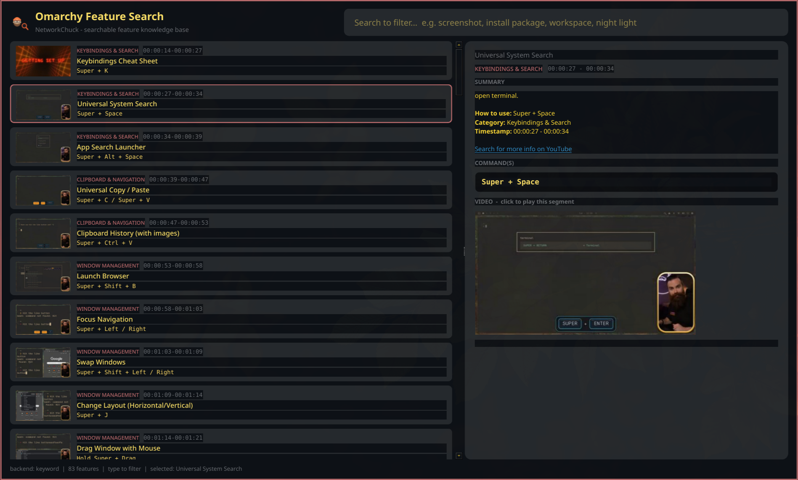

# Omarchy Feature Search

A native Linux desktop app that turns NetworkChuck's *"Omarchy Can Do WHAT?! 50
Features You're Missing"* video into a searchable knowledge base.

Browse all 83 features, search to filter the list, click one to see its details
(name, summary, command, thumbnail), and click the thumbnail to play that
exact segment of the video in-app with audio.

Built for [Omarchy](https://omarchy.org/) (Arch + Hyprland). The UI loads the
active Omarchy theme's `colors.toml` at runtime, so it always matches your
desktop look and feel.

**Source:** https://github.com/mightywomble/omarchy-feature-search



## Features

- **Master-detail layout** — browsable list of all 83 features (group, name,
  command, thumbnail) on the left; detail panel on the right.
- **Live search** — type to filter the list instantly. Uses fast keyword search
  immediately, then switches to semantic vector search (ChromaDB +
  `sentence-transformers`) once the model finishes loading in the background.
- **In-app video playback** — clicking a thumbnail downloads just the segment
  (<=480p, AAC audio, cached per segment) and plays it in-app via Qt Multimedia,
  pausing at the clip's end. First click per segment takes ~20s (one-time
  download); subsequent clicks are instant from cache.
- **Fun progress overlay** — rotating tech phrases ("Cleaning the lugnuts...",
  "Tweaking the pipes...", etc.) while the segment downloads.
- **Informative summaries** — rich-text summary with description, how-to,
  category, timestamp, and a link to search for more info on YouTube.
- **Themed** — matches the active Omarchy desktop theme automatically.

---

## Installation

### Option 1: Build and install from the PKGBUILD (Arch/Omarchy)

This is the recommended method on Arch-based systems. It builds a proper pacman
package with launcher integration.

#### Prerequisites

```fish
sudo pacman -S --needed base-devel
```

#### Build and install

```fish
git clone https://github.com/mightywomble/omarchy-feature-search.git
cd omarchy-feature-search/packaging/aur
makepkg -si PKGBUILD
```

`makepkg -si` will:
- Download the `v0.1.0` release tarball from GitHub
- Build the Python wheel
- Install it via pacman (2.0 MiB, includes 84 bundled thumbnails)
- Drop a `.desktop` entry + icon so it appears in the Super+Space launcher
- Register the `omarchy-feature-search` command in `/usr/bin/`

After install you'll see a message with optional dependency instructions
(see [Optional: Semantic Search](#optional-semantic-search) below).

#### Git variant (tracks latest HEAD, no release tag needed)

```fish
git clone https://github.com/mightywomble/omarchy-feature-search.git
cd omarchy-feature-search/packaging/aur
makepkg -si PKGBUILD-git
```

### Option 2: Install from AUR (when available)

> AUR registration is currently paused. Once it reopens, the package will be
> published for one-command install:

```fish
yay -S omarchy-feature-search
# or: paru -S omarchy-feature-search
```

To publish it yourself, see `packaging/aur/README.md` for step-by-step AUR
submission instructions.

### Option 3: pipx (non-Arch distros)

```fish
pipx install omarchy-feature-search
```

### Option 4: From source (development)

```fish
git clone https://github.com/mightywomble/omarchy-feature-search.git
cd omarchy-feature-search
python -m venv venv && source venv/bin/activate
pip install -e ".[dev]"
python -m omarchy_feature_search
```

---

## Requirements

### Installed automatically by the package

| Dependency | Purpose |
|---|---|
| Python 3.11+ | Runtime |
| PySide6 | Qt GUI + Qt Multimedia (in-app video/audio) |
| yt-dlp | Segment download from YouTube |
| ffmpeg | Video merge/transcode during download |

### Optional (for semantic search)

| Dependency | Purpose |
|---|---|
| python-sentence-transformers | Semantic vector search backend |
| python-chromadb | Persistent vector index |

These are AUR-only packages (not in official Arch repos) and pull in
`python-pytorch` (~2GB), so they're opt-in rather than forced.

---

## Optional: Semantic Search

The app works out of the box with fast **keyword search**. To unlock
**semantic search** (understands meaning, not just keywords):

### 1. Install the optional dependencies

```fish
yay -S python-sentence-transformers python-chromadb
```

This pulls in `python-pytorch` (~2GB download). If you don't have `yay`:

```fish
paru -S python-sentence-transformers python-chromadb
```

### 2. Build the vector index (one-time)

```fish
git clone https://github.com/mightywomble/omarchy-feature-search.git
cd omarchy-feature-search
python -m venv venv && source venv/bin/activate
pip install sentence-transformers chromadb
python -m data_pipeline.build_data --steps embed
```

This embeds all 83 features into a ChromaDB index. After this, the app
automatically detects the index and switches from keyword to semantic search on
next launch.

### What happens without semantic search

The app is fully functional with keyword search only:
- Type "screenshot" -> finds the screenshot feature
- Type "install" -> finds package install features
- Thumbnails and video playback work regardless

Semantic search adds the ability to find features by meaning, e.g. "how do I
take a picture of my screen" matches the screenshot feature even though none
of those exact words appear in the feature name.

---

## Usage

1. **Launch** the app from the Super+Space launcher (search "Omarchy Feature
   Search") or run `omarchy-feature-search` in a terminal.
2. **Browse** — the left pane shows all 83 features with group, name, command,
   and thumbnail. Scroll to browse.
3. **Search** — type in the search box to filter the list instantly. Try
   "screenshot", "install", "workspace", "night light", "clipboard".
4. **Select** — click a feature to see its details on the right: name, summary,
   command(s), and a video thumbnail.
5. **Play** — click the video thumbnail to play that segment of the video
   in-app with audio. The first play of each segment downloads it once (~20s
   with a fun progress overlay); replays are instant from cache. Playback
   pauses at the end of the clip.
6. **More info** — the summary includes a clickable link to search for more
   info about that feature on YouTube.

---

## Build the bundled data (one-time, optional)

The app ships with a pre-built `features.json` (83 features + transcript
summaries from the video's auto-generated subtitles) and 84 frame thumbnails.

To rebuild the data (e.g. for a different video or updated features):

```fish
python -m data_pipeline.build_data --steps transcript,thumbnails,embed
```

| Step | What it does | Needs |
|---|---|---|
| `transcript` | Pulls auto-generated subtitles, slices per feature | yt-dlp |
| `thumbnails` | Downloads video, grabs a frame at each feature's start time | yt-dlp, ffmpeg |
| `embed` | Embeds features into a ChromaDB vector index | sentence-transformers, chromadb |

Each step is independent and safe to re-run.

---

## Tests

```fish
pip install -e ".[dev]"
pytest
```

16 tests covering VTT parsing/slicing, timestamp parsing, seed integrity,
keyword search ranking/confidence/sorting, semantic index availability, and
GUI smoke (builds the main window offscreen).

---

## Uninstall

```fish
sudo pacman -R omarchy-feature-search
```

---

## Project layout

```
omarchy-feature-search/
  src/omarchy_feature_search/   # runtime package
    app.py                        # PySide6 master-detail main window
    search.py                     # keyword + semantic search engine
    player.py                     # segment download + cache
    theme.py                      # Omarchy colors.toml -> Qt stylesheet
    data.py                       # bundled data locator
    data/features.json           # 83 features + transcript summaries
    data/thumbnails/             # 84 frame thumbnails (JPEG)
    assets/                      # NetworkChuck-themed icon + logo SVGs
  data_pipeline/                 # one-time data build
    extract_table.py             # seed 83 features from the PDF
    vtt.py                       # WebVTT parser + timestamp slicer
    build_data.py                # CLI: transcript, thumbnails, embed
  packaging/aur/                # AUR PKGBUILD + .desktop + install script
  tests/                         # 16 pytest tests
```

## License

MIT
